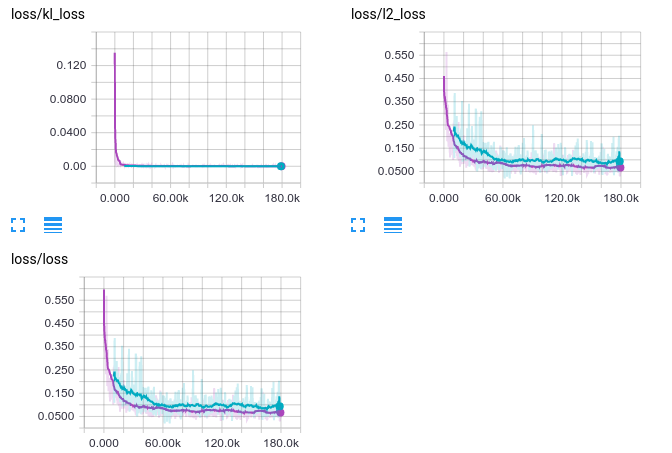

<font size=4><b>Visual Dynamics: Probabilistic Future Frame Synthesis via Cross Convolutional Networks.</b></font>

<b>Introduction</b>

https://arxiv.org/pdf/1607.02586v1.pdf

This is an implementation based on my understanding, with small
variations. It doesn't necessarily represents the paper published
by the original authors.

Authors: Xin Pan, Anelia Angelova

<b>Results:</b>




<b>Prerequisite:</b>

1. Install TensorFlow (r0.12), Bazel.

2. Download the Sprites dataset or generate moving object dataset.

Sprites data is located here:

http://www.scottreed.info/files/nips2015-analogy-data.tar.gz

Convert .mat files into images and use sprites_gen.py to convert them
to tf.SequenceExample.

<b>How to run:</b>

```shell
$ ls -R
.:
data  next_frame_prediction  WORKSPACE

./data:
tfrecords  tfrecords_test

./next_frame_prediction:
cross_conv  g3doc  README.md

./next_frame_prediction/cross_conv:
BUILD  eval.py  objects_gen.py  model.py  reader.py  sprites_gen.py  train.py

./next_frame_prediction/g3doc:
cross_conv2.png  cross_conv3.png  cross_conv.png


# Build everything.
$ bazel build -c opt next_frame_prediction/...

# The following example runs the generated 2d objects.
# For Sprites dataset, image_size should be 60, norm_scale should be 255.0.
# Batch size is normally 16~64, depending on your memory size.

# Run training.
$ bazel-bin/next_frame_prediction/cross_conv/train \
    --batch_size=1 \
    --data_filepattern=data/tfrecords \
    --image_size=64 \
    --log_root=/tmp/predict

step: 1, loss: 24.428671
step: 2, loss: 19.211605
step: 3, loss: 5.543143
step: 4, loss: 3.035339
step: 5, loss: 1.771392
step: 6, loss: 2.099824
step: 7, loss: 1.747665
step: 8, loss: 1.572436
step: 9, loss: 1.586816
step: 10, loss: 1.434191

# Run eval.
$ bazel-bin/next_frame_prediction/cross_conv/eval \
    --batch_size=1 \
    --data_filepattern=data/tfrecords_test \
    --image_size=64 \
    --log_root=/tmp/predict
```
